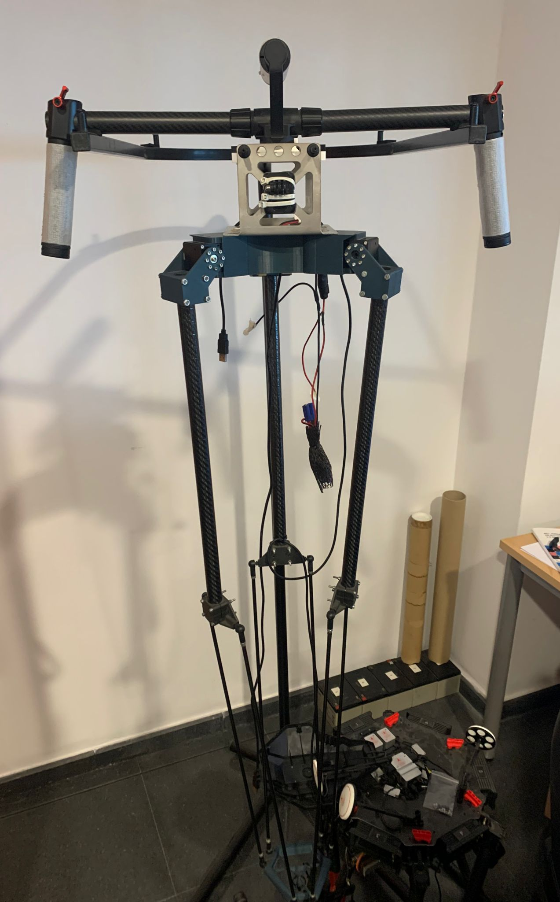

# Admittance_Controller

## Overview

This package contains an admittance controller for a delta parallel manipulator.

**Keywords:** example, package, template

Or, add some keywords to the Bitbucket or GitHub repository.

### License

**Author: Victor Rosillo 
University of Malaga
Maintainer: Victor Rosillo Suero, vrosillo1110@gmail.com**

<!-- This is research code, expect that it changes often and any fitness for a particular purpose is disclaimed. -->

<!--  -->

### Publications

## Installation

### Installation from Packages
ROS version Melodic
    
Use `rosdep`:

	sudo rosdep install --from-paths src

### Building from Source

#### Building

To build from source, clone the latest version from this repository into your catkin workspace and compile the package using

	cd catkin_workspace/src
	git clone https://github.com/Robotics-Mechatronics-UMA/admittance_controller.git
	cd ../
	rosdep install --from-paths . --ignore-src
	catkin_make

## Usage

Describe the quickest way to run this software, for example:

Run the dummy test for the controller, you can save a rosbag file and watch the results of the simulation

	roslaunch admittance_controller controller.launch

## Config files

params.yaml

## Launch files

controller.launch

## Nodes

Node1 admittance_controller_node: an admittance controller for a 6 DoF parallel manipulator.

Node2 dummy_test_noded: a test node that you can launch if you want to test the admittance controller and check the results.

### ADMITTANCE_CONTROLLER

#### Subscribed Topics

* **`/Force`** ([geometry_msgs/Twist])

	Where the reading of the force sensor will be published.

#### Published Topics

* **`/Vel`** ([geometry_msgs/Twist])

## Bugs & Feature Requests